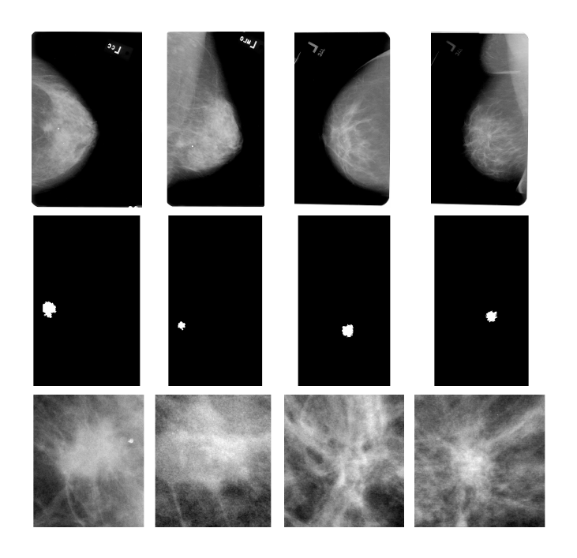
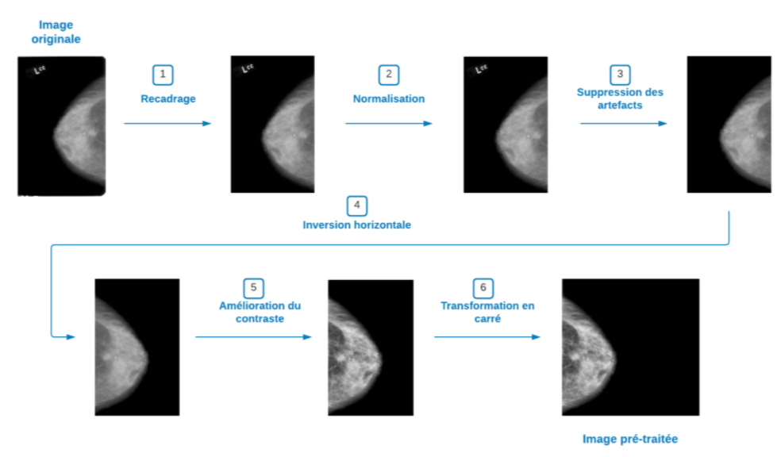
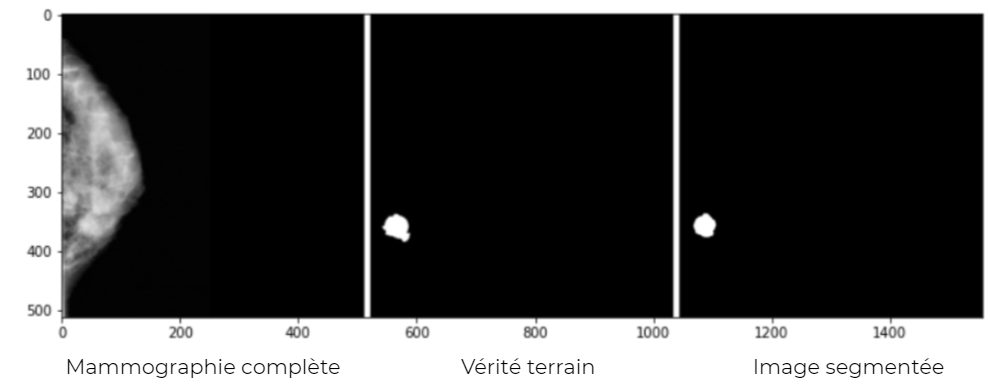

# Breast-Cancer-Diagnosis
Breast cancer is the second cause of dead among women in the world. Early detection followed by appropriate cancer treatment can reduce the deadly risk. Medical professionals can make mistakes while identifying a disease That's why the help of technology and especially artificial intelligence can substantially improve the diagnosis accuracy. 
In order to detect the breast masses, we used the deep learning approach and especially the segmentation to help Medical experts identify the desease.

## 1. Dataset
My team and me worked on the **CBIS-DDSM** dataset which had **3103 images** divided into **2458 images for training** and **645 images for test** composed of mammography images and the corresponding masks.

We performed data preprocessing on the images of the dataset to improve the quality and get better results by :

* Normalisation
* Crop borders
* Removing artifacts from images
* Horizontal flip
* Enhancement
* Change to square
* Merging masks

## 2. Implementation
When it comes to the model of image segmentation, we used **UNet** pretrained model with a pretrained **VGG19** as backbone.
The architecture of UNet contains two paths. First path is the contraction path (also called as the encoder) which is used to capture the context in the image. The encoder is just a traditional stack of convolutional and max pooling layers. The second path is the symmetric expanding path (also called as the decoder) which is used to enable precise localization using transposed convolutions. Thus it is an end-to-end fully convolutional network (FCN), i.e. it only contains Convolutional layers and does not contain any Dense layer because of which it can accept image of any size.

At first, we used the classic and UNet segmentation model to our dataset. Then, in order to get better results we tried to customize the first path of the UNet model by using the **MobileNet V2** and the **VGG19** pretrained models.  

## 3. Evaluation and results
As for evaluation metrics, we used mainly the **IOU** (Intersection Over Union) and the **dice coefficient** to measure the performance of our three models and do the comparison between them : 

|  | UNet | UNet+MobileNetV2 | **UNet+VGG19** |
| ---------------- | ------ | ---------------- | ---------- |
| dice coefficient | 0.4689 | 0.4851 | **0.4970** |
| IOU | 0.3228 | 0.3343 | **0.3447** |
| Loss | 0.5377 | 0.5195 | **0.5077** |
| Recall | 0.3271 | 0.4015 | **0.3960** |
| Precision| 0.7122 | 0.5797 | **0.6271** |

### Results : 

